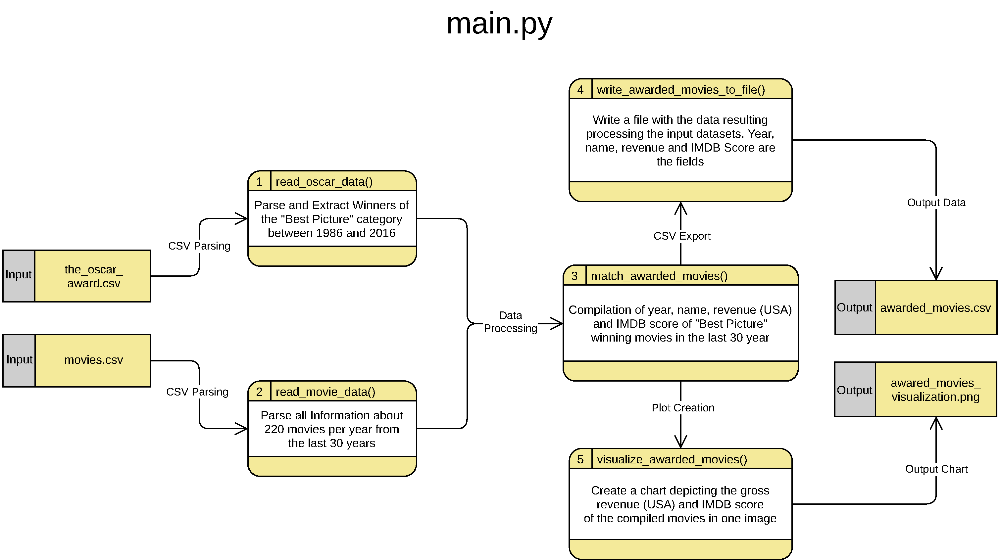

[](https://zenodo.org/badge/latestdoi/352670789)

- [Progression of Revenue and IMDb Score of Oscar “Best Picture” Winners From 1986 Until 2016](#progression-of-revenue-and-imdb-score-of-oscar-best-picture-winners-from-1986-until-2016)
    - [Data Sources](#data-sources)
    - [Data Flow](#data-flow)
    - [Directory and File Structure](#directory-and-file-structure)
    - [Running the Experiment](#running-the-experiment)
        - [Option A: Local Python Interpreter](#option-a-local-python-interpreter)
            - [Preparing a Virtual Environment (optional)](#preparing-a-virtual-environment-optional)
            - [Executing the Experiment](#executing-the-experiment)
        - [Option B: Docker](#option-b-docker)
            - [Option A.1: Executing the Container With the Provided Defaults (Recommended)](#option-a1-executing-the-container-with-the-provided-defaults-recommended)
            - [Option A.2: Interactively Running the Container and Executing the Script Manually](#option-a2-interactively-running-the-container-and-executing-the-script-manually)
            - [Retrieving the Result Directory From the Container](#retrieving-the-result-directory-from-the-container)
            - [Deleting the Container (Optional)](#deleting-the-container-optional)
            - [Deleting the Image (Optional)](#deleting-the-image-optional)
        - [Example Log Output](#example-log-output)
    - [Re-generating the Documentation](#re-generating-the-documentation)
        - [Local Python Interpreter](#local-python-interpreter)
        - [Docker](#docker)
        - [Example Documentation Log Output](#example-documentation-log-output)

# Progression of Revenue and IMDb Score of Oscar “Best Picture” Winners From 1986 Until 2016

This experiment serves the purpose of investigating how the gross revenue (USA) and the IMDb user score of movies that were awarded an Oscar in the
category "Best Picture" have evolved and fluctuated over the last three decades. More specifically, movies that were released between 1986 and 2016
are investigated.

It builds upon two data sources, one of which provide data about Oscar awarded movies. The other one is a compilation of general information about
movies that are publicly accessible via the IMDb website.

When processing these datasets, the relevant information is assembled by "matching" movie entries from both sources. In the context of this
experiment, two films are defined to be equal if and only if their titles and release years are equal.

## Data Sources

The project is based on two publicly available datasets which are already part of the files in this repository.

* Fontes, Raphael. (2020, February). The Oscar Award, 1927 - 2020, Version 7. Retrieved March 27, 2021
  from <https://www.kaggle.com/unanimad/the-oscar-award/version/7>. 892 KB.
* Grijalva, Daniel. (2017, October). Movie Industry, Version 2. Retrieved March 27, 2021
  from <https://www.kaggle.com/danielgrijalvas/movies/version/2>. 953 KB.

## Data Flow



## Directory and File Structure

The listing below illustrates the directory structure of the experiment, along with its most important files.

Files that are prefixed with an asterisk (`*`) are absolutely imperative to executing the script and must be present at the specified location
(relative to the root directory of this repository) in order for the experiment to be successfully conducted.

```shell
.
├── data
│   ├── * movies.csv
│   └── * the_oscar_award.csv
├── documentation
│   ├── data_flow
│   │   ├── data_flow.pdf
│   │   └── data_flow.png
│   ├── src
│   │   ├── awarded_movie.html
│   │   ├── index.html
│   │   ├── main.html
│   │   ├── movie.html
│   │   └── oscar_info.html
│   │── data_metadata.xml
│   │── visualization_description.txt
|   └── visualization_metadata.txt
├── result
│   ├── awarded_movies.csv
│   └── awarded_movies_visualization.png
├── src
│   ├── __init__.py
│   ├── * awarded_movie.py
│   ├── * main.py
│   ├── * movie.py
│   └── * oscar_info.py
├── Dockerfile
├── requirements-doc.txt
└── requirements.txt
```

* `data`: raw datasets that are processed
    * `movies.csv`: 6820 movies from 1986 until 2016 with attributes such as budget, genre, gross revenue, IMDb user score; data was scraped from IMDb
    * `the_oscar_award.csv`: records of past Oscar winners and nominees between 1927 and 2018; data was scraped from the official Academy Awards
      search site
* `documentation`: files that provide additional information about the experiment
    * `data_flow`: high-level architectural overview of how data is processed, in `PNG` and `PDF` format
    * `src`: source code documentation in `HTML` generated from docstrings, `index.html` as entrypoint for the webbrowser
    * `metadata.xml`: [EML](https://eml.ecoinformatics.org/) compliant `XML` representation of metadata about the experiment (abstract, creator,
      description of output data, ...)
    * `visualization_description.txt`: textual documentation/description of the output diagram
    * `visualization_metadata.txt`: metadata about the image representing the output diagram (size, resolution, MIME type, modified date, ...)
* `result`: represents the result ("output") of the experiment
    * `awarded_movies.csv`: the raw result data with the movies' release years, IMDb scores, and gross revenues (USA) as fields ("columns")
    * `awarded_movies_visualization.png`: a plot that depicts the gross revenue (USA) as well as the IMDb scores of the compiled movies in one line
      chart
* `src`: Python source files that make up the experiment
    * `main.py`: bundles input data parsing, processing and exporting of results
    * `awarded_movie.py`, `movie.py`, `oscar_info.py`: model classes that are Python representations of data rows from `awarded_movies.csv`,
      movies.csv` and `the_oscar_award.csv`, respectively
* `Dockerfile`: a text document with commands Docker can read and build an image from
* `requirements.txt`: a file listing using which the Python dependencies of the script can be conveniently installed
* `requirements-doc.txt`: a file listing using which the Python dependencies for generating the `HTML` source code documentation can be conveniently
  installed

## Running the Experiment

### Option A: Local Python Interpreter

This experiment was conceived using Python `3.7`. Any higher, backwards-compatible version and most probably `3.6` will also work without any
problems.

#### Preparing a Virtual Environment (optional)

If you do not want to pollute your global Python installation with the dependencies of the main script, you can create a virtual environment that is
local to the experiment directory.

_**Note:** In the following, `python37` is used to denote the executable of your installation of Python `3.7`, but could - for instance - also be
replaced by the (absolute path to the) executable of Python `3.8`. On the other hand, `python` refers to the Python executable within the virtual
environment_

In case you don't have the `virtualenv` module installed or if you are not sure, enter the following command:

```shell
python37 -m pip install virtualenv
```

Next, you can create a directory within the experiment's root folder that will contain the virtual environment. Following common conventions,
**.venv** or **venv** are good choices for the folder's name:

```shell
python37 -m virtualenv .venv
```

Above command(s) create a virtual environment containing, amongst others, a copy of the Python interpreter and the standard library.

In order to use the virtual environment, you need to activate it. The following table depicts how to activate it, depending on your operating system
and shell environment:

| Environment        | Command                         |
|--------------------|---------------------------------|
| Windows CMD        | `.venv\Scripts\activate.bat`     |
| Windows PowerShell | `.\.venv\Scripts\activate.ps1`   |
| Unix/MacOS bash    | `source .venv/bin/activate`      |
| Unix/MacOS csh     | `source .venv/bin/activate.csh`  |
| Unix/MacOS fish    | `source .venv/bin/activate.fish` |

After activating the virtual environment, your shell's prompt should be prefixed with `(.venv)` and running `python`, `pip` and the like will execute
the particular version of the Python interpreter the virtual environment is based on. On Unix-like systems, this can be verified using `which python`,
on Windows with `where.exe python` (the `.exe` is only mandatory in PowerShell). The command should return a path to the executable within the `.venv`
folder on top.

_**Note:** When you are done with the experiment and want to exit the virtual environment, simply type `deactivate` (this command is registered upon
activating the virtual environment) or - if that should fail - close the shell._

#### Executing the Experiment

Before the script can be executed, the required dependencies need to be installed:

```shell
python -m pip install -r requirements.txt
```

Finally, the experiment is run by simply invoking the main script:

```shell
python src/main.py
```

### Option B: Docker

If you don't have Python installed on your machine or do not want to install another version (if yours should not work), you can also run the
experiment in a Docker container.

First, you need to build the image based on the provided `Dockerfile`. This can be achieved with the following command (don't forget the dot `.` at
the end):

```shell
docker build -t omrsp:latest .
```

The command above creates a Docker **image** with the name **omrsp:latest** which contains the `data` directory, the `src` directory as well as
the `requirements.txt` file.

Upon building the image, the correct version of Python (`3.7`) is installed, along with all the modules the script depends on, as specified in
the `requirements.txt`.

_**Note:** If you perform modifications to the source code and want to build them into an image without overwriting the original one, you can change
the tag `latest` to any other distinguishable identifier of your choice._

There are two possibilities to execute the image as a container. They both achieve the same, but based on individual preferences, one might be chosen
over the other.

#### Option A.1: Executing the Container With the Provided Defaults (Recommended)

This method is recommended for its simplicity.

Run the previously built image as a **container** with the name **omrsp_container**:

```shell
docker run --name omrsp_container omrsp:latest
```

The instruction starts up the container with the specified name and immediately executes the main script. After execution, the container exits
automatically.

_**Note:** In order to start the container another time after exiting, the `start` command is required instead of `run`:_

```shell
docker start -a omrsp_container
```

_(The `-a` flag, a shorthand for `--attach`, is required to start the container in the foreground, just like when running it with `docker run`.)_

#### Option A.2: Interactively Running the Container and Executing the Script Manually

For the curious-minded people who prefer doing most of the work themselves, there is of course the possibility to interactively start the container:

```shell
docker run --name omrsp_container -it omrsp /bin/bash
```

_(The `-it` flags, a shorthand for `--interactive --tty`, allocate an interactive terminal session into the container, with `bash` as the shell)_

After starting the terminal session, the experiment can be run by invoking it using Python:

```shell
python ./src/main.py
```

_(If you prefer absolute paths, you may also call `python /home/src/main.py`.)_

Finally, you can exit the container with `CTRL+D` or `exit`.

_**Note:** In order to start the container another time after exiting, the `start` command is required instead of `run`:_

```shell
docker start -i omrsp_container
```

_(The `-i` flag, a shorthand for `--interactive`, is required to start the container interactively, with the terminal allocated when running it
with `docker run -it`.)_

#### Retrieving the Result Directory From the Container

In order to copy the results from the exited container to the host, run the following command (don't forget the dot `.` at the end):

```shell
docker cp omrsp_container:/home/result .
```

This command copies the whole directory tree `/usr/src/app/result` into the current working directory (the experiment root), overwriting files that
already exist in `./result` with the same filename.

#### Deleting the Container (Optional)

In order to keep the system clean and tidy, one might not want to keep containers that are not actively used anymore. This can be achieved with the
following command:

```shell
docker container rm omrsp_container
```

#### Deleting the Image (Optional)

Similar to the deletion of the container, it could be preferable to remove the image from which the container was created. The following instruction
accomplishes this:

```shell
docker image rm omrsp:latest
```

_**Note:** In order to safely delete the image, you should first remove the container._

### Example Log Output

If the directory structure is correct and installing the required dependencies (or building and starting the Docker container) went well, then the
output of a successful execution of the script looks something like this (taken from an execution via Docker):

```shell
Ensuring result directory "/home/result" exists...Done.
Filtered 31 oscar information entries from "/home/data/the_oscar_award.csv".
Read 6820 movie information entries from "/home/data/movies.csv".
Matched 31 movies with awards.
Wrote result of data processing to file "/home/result/awarded_movies.csv".
Saved plot of processed data to file "/home/result/awarded_movies_visualization.png".
```

## Re-generating the Documentation

If you have made changes to the source code, you may want to re-generate the source code documentation.

### Local Python Interpreter

In case you are using a virtual environment, make sure it is activated as explained
in [Preparing a Virtual Environment (optional)](#preparing-a-virtual-environment-optional). Subsequently, the module `pdoc3`
required for the documentation generation can be installed:

```shell
python -m pip install -r requirements-doc.txt
```

_**Note:** There might be available newer versions of `pdoc3` which are incompatible with the `~=0.9.2` restriction (e.g. new major versions).
If `pip` fails to find a matching distribution, feel free to install a version that is more current than the one specified in `requirements-doc.txt`.
In that case, however, the invocation required to generate the documentation might differ from the one given below due to a possibly altered command
line interface - consult `pdoc --help`, then._

First, you need to change into the `src` directory because otherwise, `pdoc` is not able to recognize module imports correctly.

```shell
cd src
```

Lastly, trigger the re-generation of the source code documentation with the following command:

```shell
python -m pdoc --force --html --output-dir ../documentation .
```

This re-creates the documentation with `--force` (overwriting existing files) into a `src` sub-folder of the `documentation` directory.

### Docker

Since image generation is quite fast, it is recommended to (re-)create the Docker image and container in order to avoid name clashes and other side
effects that are related to an already existing container of this experiment. Hence, to be on the safe side, first delete the container (if there is
not such container, an message will be returned, which can be safely ignored):

```shell
docker container rm omrsp_container
```

To (re-)build the image, run the following command (don't forget the dot `.` at the end):

```shell
docker build -t omrsp:latest .
```

Afterwards, run the container with `src` as working directory (otherwise, `pdoc` is not able to recognize module imports correctly) and trigger the
re-generation of the documentation:

```shell
docker run --name omrsp_container --workdir /home/src omrsp python -m pdoc --force --html --output-dir ../documentation .
```

This re-creates the documentation with `--force` (overwriting existing files) into a `src` sub-folder of the `documentation` directory. If you
encountered an error `/usr/local/bin/python: No module named pdoc`, then most likely the installation of `pdoc3` failed during the image build. In
this case, refer to the notes in [Local Python Interpreter](#local-python-interpreter)

Finally, the generated documentation needs to be copied from the container to the host system:

```shell
docker cp omrsp_container:/home/documentation/src ./documentation
```

### Example Documentation Log Output

If nothing went wrong, the output of a successful execution of `pdoc` looks something like this (taken from an execution via Docker):

```shell
../documentation/src/index.html
../documentation/src/awarded_movie.html
../documentation/src/main.html
../documentation/src/movie.html
../documentation/src/oscar_info.html
/usr/local/lib/python3.7/site-packages/markdown/util.py:87: DeprecationWarning: SelectableGroups dict interface is deprecated. Use select.
  INSTALLED_EXTENSIONS = metadata.entry_points().get('markdown.extensions', ())
```

The deprecation warning is library-related, can safely be ignored and will (hopefully) be fixed in future versions of `pdoc`.